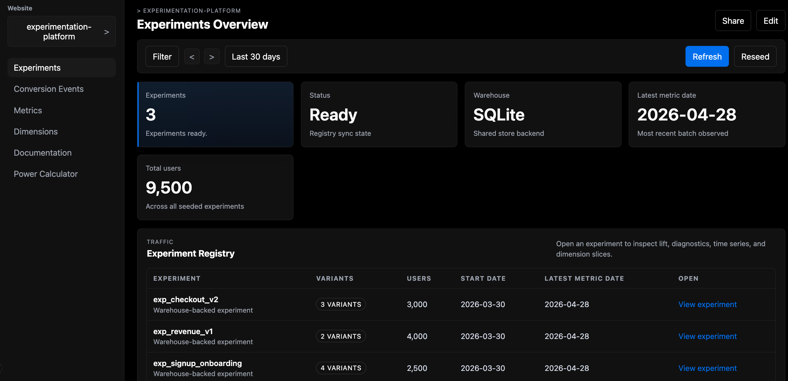

<p align="center">
  
</p>

# ExpLab: Warehouse-Native Experimentation Platform

ExpLab is a modern, open-source, warehouse-native experimentation platform designed to run A/B tests and calculate statistical significance directly on top of your existing data warehouse. 

Instead of copying sensitive user event data to a third-party analytics tool, ExpLab operates **where your data already lives**. This guarantees single-source-of-truth accuracy, dramatically reduces latency, and protects user privacy.

<p align="center">
  
</p>

## ✨ Key Features

### 🏢 Warehouse-Native Architecture
- **Zero Data Movement:** Query your metrics and conversion events directly from your database.
- **SQLite Demo:** Comes with a built-in SQLite data warehouse to simulate and test a live environment out-of-the-box.
- **Easily Extensible:** Designed to easily connect to Snowflake, BigQuery, Redshift, or any SQL-based data warehouse.

### 🔬 Advanced Statistical Engine
- **Metric Categorization:** Organize metrics into **Primary** (your North Star), **Secondary** (contextual), and **Guardrail** (do no harm) categories to prevent multiple-testing penalties.
- **Multiple Testing Corrections:** Built-in support for controlling the False Discovery Rate (FDR) using Benjamini-Hochberg or Bonferroni adjustments.
- **Sample Ratio Mismatch (SRM) Checks:** Automatically detect if your traffic routing is broken or biased.
- **Dimension Balance Checks:** Automatically run Chi-Squared tests to ensure demographic/device segments are evenly distributed across variants.

### ⚙️ Customizable Metrics & Overrides
- **Winsorization:** Automatically clip extreme outliers (e.g., at the 99th percentile) to reduce noise in revenue or continuous metrics.
- **Experiment-Level Overrides:** Set global defaults for conversion windows or winsorization, but override them inline for specific experiments without touching the code.
- **Deep Dives:** Instantly view the raw SQL query generated for any specific conversion event or metric.

### 🧪 Planning & Simulation Tools
- **Power Calculator:** Built-in statistical power calculator to determine exactly how large your sample size needs to be to detect a Minimum Detectable Effect (MDE).
- **Data Simulator:** A robust background simulator that can seed a massive dummy warehouse of users, events, and conversions so you can test platform features immediately.

## 🤝 The Open Source Advantage

ExpLab is completely open-source. Why does this matter for experimentation?
- **Data Privacy & Compliance:** By running on your infrastructure, your user IDs and sensitive revenue data never leave your virtual private cloud (VPC). No more third-party data processing agreements (DPAs) or GDPR headaches.
- **Cost Efficiency:** SaaS experimentation platforms charge exorbitant fees based on Monthly Tracked Users (MTUs) or events. ExpLab leverages your existing compute, making it drastically cheaper at scale.
- **Custom Definitions:** You own the SQL. If your business defines a "conversion" with complex logic, you can natively define it in ExpLab rather than hacking a third-party SDK.

---

## 🚀 Getting Started

The fastest path is Docker Compose: one command starts the FastAPI backend and the Next.js frontend together.

### Prerequisite
- Docker with Compose support

### 1. Start Everything

```bash
docker compose up --build
```

This starts:
- the backend on `http://localhost:8000`
- the frontend on `http://localhost:3000`

### 2. First Run

1. Open `http://localhost:3000`
2. Create the initial admin account
3. Click `Seed Demo Data` on the experiments page

The demo SQLite warehouse lives at `backend/data/experiment.db` and is only populated when you trigger the seed action from the UI.

### Local Development Without Docker

The platform is split into a Python FastAPI backend and a Next.js App Router frontend.

#### Backend

```bash
cd backend
python3 -m venv .venv
source .venv/bin/activate
pip install -r requirements.txt
uvicorn app.main:app --reload --port 8000
```

#### Frontend

```bash
cd frontend
npm install
npm run dev
```

By default, the frontend expects the backend on port `8000`. If needed, create `frontend/.env.local` and set `NEXT_PUBLIC_API_BASE_URL=http://127.0.0.1:YOUR_PORT`.

---

## 🛠️ Tech Stack
- **Backend:** FastAPI, Python, SQLite, SciPy, Statsmodels, Pandas, Numpy.
- **Frontend:** Next.js (App Router), React, TypeScript, Vanilla CSS.
